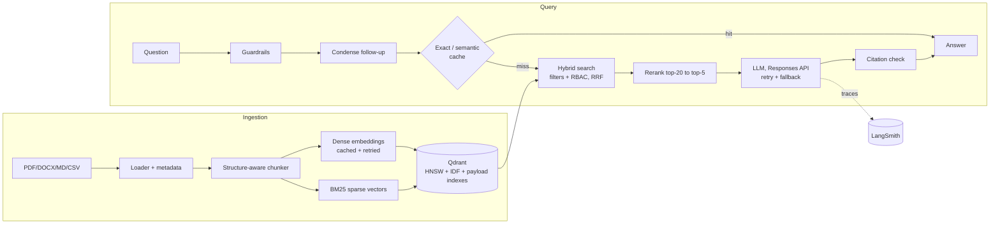

# HR Document Assistant: Production RAG API

A production-grade Retrieval-Augmented Generation service that answers employee questions about HR policies with **grounded, cited answers**. It's built with FastAPI, Qdrant, the OpenAI Responses API and LangSmith, and follows a standard modular RAG project layout.

| Concern | What's implemented |
|---|---|
| **Retrieval** | Hybrid search: dense embeddings + BM25 sparse vectors, fused with **Reciprocal Rank Fusion inside Qdrant** |
| **Vector index** | Tunable **HNSW** (`m`, `ef_construct`, `ef_search`), optional int8 scalar quantization, payload indexes |
| **Metadata filtering** | Department / doc type / category / region / tags / source / effective-date range, applied *during* the HNSW search |
| **Access control** | Role-based (`employee`, `manager`, `hr_admin`), enforced as a vector-DB filter, so confidential chunks can never reach the LLM |
| **Reranking** | OpenAI model grades the top-20 passages (structured JSON output), or Cohere Rerank. Fails open on errors |
| **Caching** | Embedding cache, exact answer cache, **semantic answer cache**, all invalidated automatically when the corpus changes. In-memory or Redis |
| **Resilience** | Exponential backoff + jitter (`max_attempts` configurable), retry only on transient errors, **fallback model**, timeouts |
| **Conversation** | Per-session memory with follow-up question condensation |
| **Guardrails** | Prompt-injection heuristics, length limits, citation validation (removes hallucinated `[n]`), "I don't know" when there is no context |
| **Observability** | LangSmith traces for every stage (retriever, rerank, LLM with token usage), user feedback to LangSmith, JSON logs with request IDs and PII redaction, Prometheus `/metrics` |
| **Ingestion** | PDF / DOCX / MD / TXT / HTML / CSV, YAML front-matter or sidecar metadata, structure-aware token chunking, **idempotent, versioned re-ingestion** (unchanged files skipped, changed files replaced) |
| **Quality** | 42 offline tests (pytest), golden-set evaluation (hit@k, MRR, keyword recall, latency) + LangSmith experiments, ruff, GitHub Actions CI |
| **Deployment** | Dockerfile (non-root, healthcheck), docker-compose with Qdrant + Redis |

---

## Architecture



## Project structure

```
├── README.md
├── requirements.txt / requirements-dev.txt
├── .env.example            # secrets template (copy to .env)
├── .gitignore
├── config.yaml             # all tunables: models, chunk size, HNSW, cache, reranker...
├── main.py                 # entry point (uvicorn)
├── src/
│   ├── ingestion/          # loader.py (multi-format), metadata.py, models.py
│   ├── chunking/           # chunker.py (structure-aware, token-based, overlap)
│   ├── embeddings/         # embedder.py (OpenAI / local / hashing), sparse.py (BM25)
│   ├── vectordb/           # vector_store.py (Qdrant: HNSW, sparse, payload indexes)
│   ├── retrieval/          # retriever.py (hybrid + RRF), filters.py, reranker.py
│   ├── prompts/            # prompt_templates.py (versioned)
│   ├── llm/                # llm_client.py (Responses API, retry, fallback, streaming)
│   ├── guardrails/         # guards.py
│   ├── pipeline/           # rag_pipeline.py, ingestion_pipeline.py, container.py (DI)
│   ├── api/                # app.py, routes.py, schemas.py, dependencies.py, middleware.py
│   └── utils/              # config.py, logger.py, cache.py, tracing.py, metrics.py, helpers.py
├── scripts/                # ingest.py, evaluate.py
├── data/raw/               # sample HR policies (with metadata front-matter)
├── data/eval/              # golden_qa.jsonl
├── tests/                  # unit + integration tests (run fully offline)
├── logs/                   # app.log (rotating, JSON)
├── Dockerfile / docker-compose.yml / Makefile
└── .github/workflows/ci.yml
```

---

## Quick start (Windows PowerShell)

```powershell
cd D:\Project\Standard_GenAI_Agentic_AI_Project
python -m venv .venv
.\.venv\Scripts\Activate.ps1
pip install -r requirements-dev.txt

# 1. Secrets: open .env and set OPENAI_API_KEY (and LANGSMITH_API_KEY for tracing)
# 2. Index the sample documents
python -m scripts.ingest
# 3. Run the API, then open http://localhost:8000/docs
python main.py
```

macOS/Linux: same commands with `source .venv/bin/activate`, or just `make dev ingest run`.

**Try it**

```powershell
$h = @{ "X-API-Key" = "dev-employee-key"; "Content-Type" = "application/json" }
Invoke-RestMethod -Method Post http://localhost:8000/api/v1/query -Headers $h `
  -Body '{"question": "How many sick leaves do I get?", "session_id": "demo"}'
```

```bash
# curl: filtered query
curl -X POST localhost:8000/api/v1/query -H "X-API-Key: dev-employee-key" -H "Content-Type: application/json" \
  -d '{"question":"hotel limit in Bengaluru?","filters":{"category":"expenses","effective_after":"2026-01-01"}}'

# streaming (Server-Sent Events)
curl -N -X POST localhost:8000/api/v1/query/stream -H "X-API-Key: dev-employee-key" \
  -H "Content-Type: application/json" -d '{"question":"How long is paternity leave?"}'

# upload a policy (hr_admin only)
curl -X POST localhost:8000/api/v1/documents -H "X-API-Key: dev-admin-key" \
  -F "files=@gratuity_policy.pdf" -F "category=benefits" -F "access_level=public" -F "effective_date=2026-04-01"
```

### Docker (production-like: Qdrant server + Redis + 2 workers)

```bash
docker compose up -d --build
docker compose exec api python -m scripts.ingest
```

---

## API

| Method | Path | Role | Purpose |
|---|---|---|---|
| GET | `/health` | none | liveness |
| GET | `/ready` | none | readiness (vector DB reachable, chunk count) |
| GET | `/metrics` | none | Prometheus metrics |
| POST | `/api/v1/query` | any | grounded answer + citations + timings + LangSmith `run_id` |
| POST | `/api/v1/query/stream` | any | SSE: `sources` → `token`… → `done` |
| POST | `/api/v1/feedback` | any | 👍/👎 on a `run_id` → LangSmith feedback |
| DELETE | `/api/v1/sessions/{id}` | any | clear conversation memory |
| POST | `/api/v1/documents` | hr_admin | upload + index files with metadata |
| POST | `/api/v1/documents/reindex` | hr_admin | index `data/raw` (unchanged files skipped) |
| GET | `/api/v1/documents` | hr_admin | list indexed documents + chunk counts |
| DELETE | `/api/v1/documents/{doc_id}` | hr_admin | remove a document |
| DELETE | `/api/v1/cache` | hr_admin | flush the answer cache |

API keys and their roles come from `API_KEYS` in `.env`. Every response carries an `X-Request-ID` header, which matches the `request_id` in the logs and the LangSmith trace metadata.

## Adding your own documents

Drop files in `data/raw/` and add metadata with either:

* **YAML front-matter** (Markdown/TXT):
  ```yaml
  ---
  title: Leave Policy
  category: leave
  access_level: public        # public | manager | confidential
  effective_date: 2026-01-01
  tags: [leave, sick leave]
  ---
  ```
* **Sidecar file** for PDF/DOCX/CSV: `policy.pdf.meta.yaml` with the same keys.
* **Upload form fields** on `POST /api/v1/documents`.

Then run `python -m scripts.ingest`. Re-running is safe: unchanged files are skipped and edited files replace their old chunks.

> The bundled documents in `data/raw` are fictional samples for demos and tests.

---

## Configuration highlights (`config.yaml`)

Any key can be overridden with an env var using `__`, e.g. `LLM__MODEL=gpt-6.1-sol`.

| Setting | Default | Notes |
|---|---|---|
| `llm.model` | `gpt-6-luna` | OpenAI's efficient GPT-6 model. Use `gpt-6.1-sol` / `gpt-6-astra` for harder reasoning |
| `llm.fallback_model` | `gpt-5.4-mini` | used automatically when the primary fails after retries |
| `llm.reasoning_effort` | `low` | `none`/`low` keep latency down for RAG |
| `embeddings.model` | `text-embedding-3-small` | `-large` for higher recall; reduce `dimensions` to save RAM |
| `vectordb.hnsw.m / ef_construct / ef_search` | 16 / 200 / 128 | raise `ef_search` for recall, lower it for latency |
| `vectordb.quantization.enabled` | false | enable for >1M chunks (4× less RAM) |
| `retrieval.top_k` | 20 | candidates before reranking |
| `reranker.provider` | `llm` | OpenAI `utility_model` scores passages 0-10; `cohere` or `none` also supported |
| `cache.semantic_threshold` | 0.95 | lower means more cache hits but more risk of reusing a near-miss answer |
| `chunking.chunk_size_tokens` | 400 | with 60 overlap. HR clauses are short, so smaller chunks retrieve more precisely |

**Vector DB modes:** `local` (embedded on-disk, zero setup, exact search) → `server` (Docker / Qdrant Cloud: real HNSW, payload indexes, multiple workers). Use `server` for staging/prod.

## Observability with LangSmith

Set `LANGSMITH_API_KEY` in `.env`. Every query becomes a trace:

```
rag_query
├── condense_question
├── embed_query            (embedding)
├── hybrid_retrieve        (retriever: documents + scores + filters)
├── rerank                 (documents + rerank scores)
└── OpenAI responses       (llm: prompt, output, token usage)
```

Trace metadata includes `role`, `cache`, `prompt_version` and `request_id`. The `run_id` returned by `/query` can be passed to `/feedback` to attach user ratings.

## Evaluation

```bash
python -m scripts.evaluate               # hit@k, MRR, keyword recall, refusal accuracy, p50/p95 latency
python -m scripts.evaluate --langsmith   # also uploads the dataset and runs a LangSmith experiment
```

Add real employee questions to `data/eval/golden_qa.jsonl` and run the eval before every prompt, model or chunking change.

## Testing

```bash
pytest                    # 42 tests, fully offline (in-memory Qdrant, hashing embedder, fake LLM)
make lint                 # ruff
```

---

## Design decisions

* **Hybrid search over pure vectors:** HR questions mix semantics ("can I work remotely abroad?") with exact terms ("POSH", "LTA", "Form 16"). BM25 sparse vectors catch the exact terms, and Qdrant computes IDF server-side, so no extra model is needed.
* **Filters inside HNSW, not post-filtering:** post-filtering silently returns fewer than `top_k` results. Qdrant's filterable HNSW plus payload indexes keeps recall intact.
* **RBAC at the retrieval layer:** the safest way to stop the LLM leaking confidential data is to never retrieve it. Prompt-level instructions alone aren't enough.
* **Corpus-versioned caches:** cache keys include a version that's bumped on every ingest/delete, so an updated policy can never be served from a stale cached answer. "Not found" answers are never cached.
* **Deterministic IDs:** `doc_id` comes from the file name and `chunk_id` from (doc_id, position), so re-ingesting is an upsert and never duplicates chunks.
* **Static system prompt + `prompt_cache_key`:** maximises OpenAI prompt-cache hits, which cuts cost and latency.
* **Own retry policy (SDK retries disabled):** one place to tune and log retries. Client errors (4xx) are never retried.

## Scaling notes

* Run with `VECTORDB__MODE=server` and `CACHE__BACKEND=redis` before using more than one worker or replica.
* Move rate limiting to Redis or your API gateway when you have multiple replicas.
* For large batch ingestion, run `scripts/ingest.py` as a job (or a queue worker) rather than through the upload endpoint.
* Enable Qdrant quantization and `on_disk` HNSW for very large corpora.
